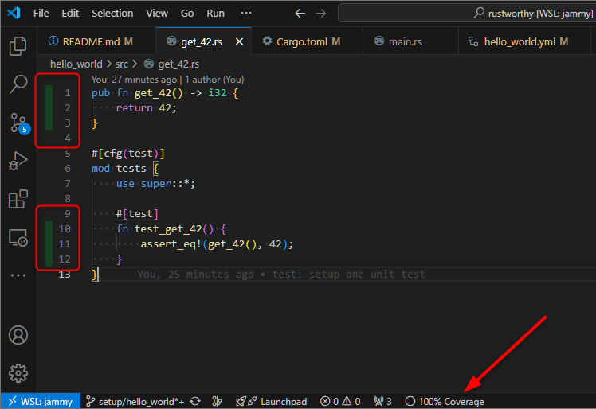

# Rustworthy

This repository is used as a scratchpad to learn Rust.

## Getting Started

Following the rich traditions of software development, I start my Rust adventure by
running a "Hello, World!" program in Rust.

Rust's [Get Started](https://www.rust-lang.org/learn/get-started) explains how to
install Rust and use Cargo, Rust's de facto standard build tool and package manager.

1. **Install Rust**: Since I use WSL2 for all my personal projects, I go with:

    ```bash
    curl --proto '=https' --tlsv1.2 -sSf https://sh.rustup.rs | sh
    ```

    This installs both Rust and Cargo.

2. **Create Hello World package**: Cargo has the `new` command to create a fully
   functional package:

   ```bash
   cargo new hello_world
   ```

   This creates a `main.rs` source file and the `Cargo.toml` manifest file.

3. **Build and execute the package**: Cargo's `build` command build the package.

    ```bash
    cargo build
    ```

    This creates the package lock file `Cargo.lock` and the executables under a
    `target` directory.

    ```bash
    ./target/debug/hello_world
    Hello, World!
    ```

4. **Commit this Hello World package to the repository**: Finally commit the source
    file, the manifest file and the lock file to the repository for future reference.

**Note**: I ommitted some intermediate steps in the above description as it is covered
in the [Cargo Book](https://doc.rust-lang.org/cargo/index.html)'s
[First Steps with Cargo](https://doc.rust-lang.org/cargo/getting-started/first-steps.html).
Rust also has the [Learn Rust](https://www.rust-lang.org/learn) documentation, which
I expect to use as a reference over time.

## Setting up Github Actions

Next I start setting up pipeline jobs using Github Actions. I will build upon this
pipeline to support the future usecases as I grow wiser about both Rust and Github
Actions.

To start with, I will run the pipeline on pushes to my sidebranch `setup/hello_world`.
The first job consists of checking out the code, setting up the rust toolchain, then
building and running the application. With Github Actions, this is simple enough to do
in a few minutes. The complete workflow is [here](.github/workflows/hello_world.yml).

[_side-note: I had previously used Github Actions for a few months, so I am reasonably
familiar with it. More recently, I have had to use Gitlab CI instead for about a year.
I have had some irritations with Github Actions' UX in the past, but when compared to
Gitlab CI's UX, Github Actions has started feeling like heaven._]

## Unit Testing

Next I want to put in place the unit testing setup. I learned that Rust convention is
to place unit tests in the same file as its source code, which is a fascinating choice.
It brought back a few frustrating memories of missing, obsolete and misplaced unit
tests, especially after some rounds of refactoring.

I created a separate source file [`get_42.rs`](hello_world/src/get_42.rs) that
contains a function and its unit test. For Cargo build (and test) to "see" the file,
the module needs to be included in the main file. The Cargo build approach to discovery
feels simpler than the more cumbersome `Makefile` approach used by ... ahem, some
other languages. :P

Testing is also integrated more directly into the Rust language, as against some other
languages where it is enabled through separate libraries or modules.

Then I ran the test locally and also updated the Github Actions job with another step
to run the test on the pipeline.

```bash
dragondive@Laughtale:~/heavens-arena/rustworthy/hello_world$ cargo test
    Finished `test` profile [unoptimized + debuginfo] target(s) in 0.01s
     Running unittests src/main.rs (target/debug/deps/hello_world-b901389d868bd6fa)

running 1 test
test get_42::tests::test_get_42 ... ok

test result: ok. 1 passed; 0 failed; 0 ignored; 0 measured; 0 filtered out; finished in 0.00s
```

To ensure that the test is working properly, I followed my usual innovative (lol)
approach of delibarately causing the test to fail by comparing `true` with `false`.

```bash
dragondive@Laughtale:~/heavens-arena/rustworthy/hello_world$ cargo test
   Compiling hello_world v0.1.0 (/home/dragondive/heavens-arena/rustworthy/hello_world)
    Finished `test` profile [unoptimized + debuginfo] target(s) in 0.64s
     Running unittests src/main.rs (target/debug/deps/hello_world-b901389d868bd6fa)

running 1 test
test get_42::tests::test_get_42 ... FAILED

failures:

---- get_42::tests::test_get_42 stdout ----
thread 'get_42::tests::test_get_42' panicked at src/get_42.rs:12:9:
assertion `left == right` failed
  left: true
 right: false
note: run with `RUST_BACKTRACE=1` environment variable to display a backtrace


failures:
    get_42::tests::test_get_42

test result: FAILED. 0 passed; 1 failed; 0 ignored; 0 measured; 0 filtered out; finished in 0.00s

error: test failed, to rerun pass `--bin hello_world`
```

Overall, my impression so far has been that Rust and Cargo give very useful messages
that help to understand and fix problems. Once again, I was reminded of my early
struggles with templates in C++03, where the error messages were incomprehensible. After
several months of struggle, I could eventually determine the problems in C++ template
code based on the "shape" of the error message. (not exaggerating!) Although I can now
look back at it now with amusement, it was an extremely frustrating period of time in
the early days of my professional career.

## Code Coverage

The next logical step after setting up unit testing is setting up code coverage. Prima
facie, the Rust ecosystem in this regard is pretty impressive. The Cargo subcommand
[`llvm-cov`](https://lib.rs/crates/cargo-llvm-cov) gets the job done well. It was easy
to install and run by following the instructions from the documentation.

The documentation explains how to view the code coverage in VS Code using the `Coverage
Gutters` extension.



It also has the Github Actions setup to upload the coverage to Codecov. Once again, I am
happy that I do not have to use Gitlab CI here. [_Sorry, Gitlab CI, given how much
frustration I have had to bear with your UX for a year, I cannot let go of any
opportunity I get to take a swipe at you._ :smiling_imp:]

I created a `CODECOV_TOKEN`, added it as a repository secret, then my pipeline job was
ready to go. The code coverage report is published on Codecov
[here](https://app.codecov.io/github/heavens-arena/rustworthy/tree/setup%2Fhello_world).
